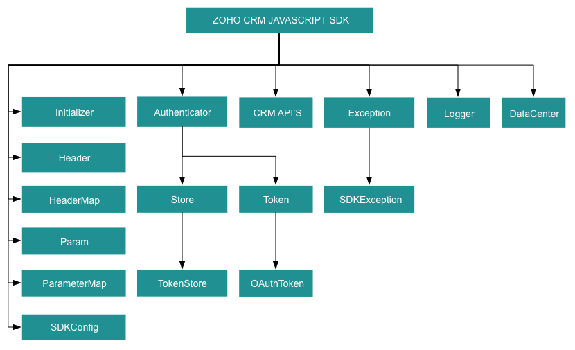

# ZOHO CRM JAVASCRIPT SDK - 2.0

Zoho CRM API version 2.

## Table Of Contents

* [Overview](#overview)
* [Registering a Zoho Client](#registering-a-zoho-client)
* [Environmental Setup](#environmental-setup)
* [Including the SDK in your project](#including-the-sdk-in-your-project)
  * [ZET Framework](#zet-framework)
* [Persistence](#token-persistence)
* [Configuration](#configuration)
* [Initialization](#initializing-the-application)
* [Class Hierarchy](#class-hierarchy)
* [Responses And Exceptions](#responses-and-exceptions)
* [Sample Code](#sdk-sample-code)

## Overview

The JavaScript SDK offers a way to create client JavaScript applications that can be integrated with Zoho CRM.

## Registering a Zoho Client

Since Zoho CRM APIs are authenticated with OAuth2 standards, you should register your client app with Zoho. To register your app:

- Visit this page [https://api-console.zoho.com/](https://api-console.zoho.com)

- Click `ADD CLIENT`.

- Choose the `Client Type` as **Client-based Applications**.

- Enter **Client Name**, **Homepage URL**, **Authorized Redirect URIs** and **JavaScript Domain**. Click `CREATE`.

- Your client app will be created and displayed now.

- Select the created OAuth client.

or

- [WebApps Integration](https://www.zoho.com/crm/developer/docs/webapp-sdk/web-integration.html#Create_Client)

## Environmental Setup

You can install any browser as per your preference. JavaScript works on any web browser on any OS.

## Including the SDK in your project

### CDN URL

- https://static.zohocdn.com/zohocrm/v2.0/sdk/2.0.0/sdk.js

### Download SDK Zip File

- [Download SDK](https://www.zoho.com/sites/default/files/crm/v2.0/zohocrmsdk_2_0_0.zip)

JavaScript SDK can be incorporated in two ways:

* [Integrating JS SDK via Webapps](https://www.zoho.com/crm/developer/docs/webapp-sdk/).

* [Using JS SDK on your own application](#using-js-sdk-on-your-own-application).

### Integrating JS SDK via Webapps

#### Follow the given steps for Integrating JS SDK

- Register the client from CRM UI and note the client ID.
- Create a new project using the command `zet init` via terminal/command line. Choose the option `Catalyst` and give the project name.
- A new folder will be created with the project name. This folder will contain the file **plugin_manifest.json**. Update the client ID in that file and add required scopes to be used in the web app.
- Under the project folder, there will be another folder named **app**. This will act as the base.
- Include the **zcrmsdk.js** file (available in app folder) and use it in your HTML files.

#### a. For Webapps Integration

- After the development, run the command `zet pack` from the project base folder and upload it in CRM UI. **FYI** : Only one app can be uploaded for each client. While updating with new app, old one has to be deleted. Also, redirect url will be changed.
- To know the redirect url, **Initializer.store.getToken(token)** function has to be accessed from web app. It will redirect to **http://accounts.zoho.com/oauth/v2/auth** along with a parameter **redirect_uri**. Configure this in **https://api-console.zoho.com**. Eg : if the redirect_uri is "https://99000000223015.zappscontents.com/appfiles/99000000223015/1.0/1dd62561c00429f2c4970bf4f2b4dc09142d08b6949a17a5c3388f30851ec9cf/redirect.html", then the **Authorized redirect URIs** is "https://99000000223015.zappscontents.com/appfiles/99000000223015/1.0/1dd62561c00429f2c4970bf4f2b4dc09142d08b6949a17a5c3388f30851ec9cf/redirect.html"
- The **JavaScript Domain** is "https://99000000223015.zappscontents.com"

#### b. To test it in local machine using web framework

- Create a redirect.html page within the app folder.
- Run it using the `zet run` via terminal/command line.
- Enter **127.0.0.1:{your_port_number}** for eg. 127.0.0.1:5000 in the browser address bar and select the app_file.html
- It'll redirect to accounts.zoho.com/oauth/v2/auth along with the parameter redirect_uri. Configure this in https://api-console.zoho.com/.
- If the page successfully redirects to the **redirect.html** page then the app works as intended.
- Once token is set for the first time, the page will be reloaded.

### Using JS SDK on your own application

- Create a redirect.html page for your application.
- Set up your own web server and authorize the SDK.
- You can then use the SDK.

## Token Persistence

## Configuration

Before you get started with creating your JavaScript application, you need to register your client and authenticate the app with Zoho.

- Create an instance of **Logger** Class to log exception and API information.

    ```js
    /*
    * Create an instance of Logger Class that takes parameter
    * 1 -> Level of the log messages to be logged. Can be configured by typing Levels "." and choose any level from the list displayed.
    */
    let logger = Logger.getInstance(Levels.ALL);
    ```

- Configure the API environment which decides the domain and the URL to make API calls.

    ```js
    /*
    * Configure the environment
    * which is of the pattern Domain.Environment
    * Available Domains: US, EU, IN, CN, AU
    * Available Environments: PRODUCTION(), DEVELOPER(), SANDBOX()
    */
    let environment = DataCenter.US.PRODUCTION();
    ```

- Create an instance of **OAuthToken** with the information that you get after registering your Zoho client.

    ```js
    /*
    * Create a Token instance
    * clientId -> OAuth client id.
    * scope -> OAuth client scope.
    * redirectURL -> OAuth Redirect URL.
    */
    let token = new OAuthBuilder()
      .clientId("clientId")
      .scope("scope")
      .redirectURL("redirectURL")
      .build();
    ```

- Create an instance of **SDKConfig** containing the SDK configuration.

    ```js
    /*
      * autoRefreshFields
      * if true - all the modules' fields will be auto-refreshed in the background, every hour.
      * if false - the fields will not be auto-refreshed in the background. The user can manually delete the cache or refresh the fields using methods from ModuleFieldsHandler
      *
      * cacheStore
      * A boolean field that allows or disallows the storage of module field information in cache.
      * True - the SDK stores all the modules' field information in cache, and refreshes every hour, if autoRefreshFields is true.
      * False - the SDK temporarily stores the modules' field information in a Map.
      *
      * pickListValidation
      * A boolean field that validates user input for a pick list field and allows or disallows the addition of a new value to the list.
      * True - the SDK validates the input. If the value does not exist in the pick list, the SDK throws an error.
      * False - the SDK does not validate the input and makes the API request with the user’s input to the pick list
      *
      * timeout
      * representing the number of milliseconds a request can take before automatically being terminated.
    */
    let sdkConfig = new SDKConfigBuilder().autoRefreshFields(true).pickListValidation(false).cacheStore(true).timeout(1000).build();
    ```

## Initializing the Application

Initialize the SDK using the following code.

```js
class SDKInitializer {
    static async initializeSDK() {
        /*
         * Create an instance of Logger Class that takes parameter
         * 1 -> Level of the log messages to be logged. Can be configured by typing Levels "." and choose any level from the list displayed.
        */
        let logger = Logger.getInstance(Levels.ALL);

        /*
         * Configure the environment
         * which is of the pattern Domain.Environment
         * Available Domains: US, EU, IN, CN, AU
         * Available Environments: PRODUCTION(), DEVELOPER(), SANDBOX()
        */
        let environment = DataCenter.US.PRODUCTION();

        /*
         * Create a Token instance
         * clientId -> OAuth client id.
         * scope -> OAuth client scope.
         * redirectURL -> OAuth Redirect URL.
         */
        let token = new OAuthBuilder()
          .clientId("clientId")
          .scope("scope")
          .redirectURL("redirectURL")
          .build();

        /*
          * autoRefreshFields
          * if true - all the modules' fields will be auto-refreshed in the background, every hour.
          * if false - the fields will not be auto-refreshed in the background. The user can manually delete the cache or refresh the fields using methods from ModuleFieldsHandler
          *
          * cacheStore
          * A boolean field that allows or disallows the storage of module field information in cache.
          * True - the SDK stores all the modules' field information in cache, and refreshes every hour, if autoRefreshFields is true.
          * False - the SDK temporarily stores the modules' field information in a Map.
          *
          * pickListValidation
          * A boolean field that validates user input for a pick list field and allows or disallows the addition of a new value to the list.
          * True - the SDK validates the input. If the value does not exist in the pick list, the SDK throws an error.
          * False - the SDK does not validate the input and makes the API request with the user’s input to the pick list
          *
          * timeout
          * representing the number of milliseconds a request can take before automatically being terminated.
        */
        let sdkConfig = new SDKConfigBuilder().autoRefreshFields(true).pickListValidation(false).cacheStore(true).build();

        /*
         * Call the static initialize method of Initializer class that takes the following arguments
         * environment -> Environment instance
         * SDKConfig -> SDKConfig instance
         * token -> Token instance
         * logger -> Logger instance
         */
        (await new InitializeBuilder())
            .environment(environment)
            .token(token)
            .SDKConfig(sdkConfig)
            .logger(logger)
            .initialize();
    }
}
```

- You can now access the functionalities of the SDK. Refer to the sample codes to make various API calls through the SDK.

## Class Hierarchy



## Responses and Exceptions

All SDK method calls return an instance of **APIResponse**.

After a successful API request, the **getObject()** method returns an instance of the ResponseWrapper (for **GET**) or the ActionWrapper (for **POST, PUT, DELETE**).

Whenever the API returns an error response, the **getObject()** returns an instance of **APIException** class.

**ResponseWrapper** (for **GET** requests) and ActionWrapper (for **POST, PUT, DELETE** requests) are the expected objects for Zoho CRM APIs’ responses

However, some specific operations have different expected objects, such as the following:

- Operations involving records in Tags
  - **RecordActionWrapper**

- Getting Record Count for a specific Tag operation
  - **CountWrapper**

- Operations involving BaseCurrency
  - **BaseCurrencyActionWrapper**

- Lead convert operation
  - **ConvertActionWrapper**

- Retrieving Deleted records operation
  - **DeletedRecordsWrapper**

- Record image download operation
  - **FileBodyWrapper**

- MassUpdate record operations
  - **MassUpdateActionWrapper**
  - **MassUpdateResponseWrapper**

### GET Requests

- The **getObject()** returns instance of one of the following classes, based on the return type.

  - For  **application/json** responses
        - **ResponseWrapper**
        - **CountWrapper**
        - **DeletedRecordsWrapper**
        - **MassUpdateResponseWrapper**
        - **APIException**

    - For **file download** responses
      - **FileBodyWrapper**
      - **APIException**

### POST, PUT, DELETE Requests

- The **getObject()** returns an instance of one of the following classes
  - **ActionWrapper**
  - **RecordActionWrapper**
  - **BaseCurrencyActionWrapper**
  - **MassUpdateActionWrapper**
  - **ConvertActionWrapper**
  - **APIException**

- These wrapper classes may contain one or an array of instances of the following classes, depending on the response
  - **SuccessResponse Class**, if the request was successful.
  - **APIException Class**, if the request was erroneous.

For example, when you insert two records, and one of them was inserted successfully while the other one failed, the ActionWrapper will contain one instance each of the SuccessResponse and APIException classes.

All other exceptions such as SDK anomalies and other unexpected behaviours are thrown under the **SDKException** class.

## SDK Sample code

```js
class Record {
    static async call() {
        /*
         * Create an instance of Logger Class that takes parameter
         * 1 -> Level of the log messages to be logged. Can be configured by typing Levels "." and choose any level from the list displayed.
        */
        let logger = Logger.getInstance(Levels.ALL);

        /*
         * Configure the environment
         * which is of the pattern Domain.Environment
         * Available Domains: US, EU, IN, CN, AU
         * Available Environments: PRODUCTION(), DEVELOPER(), SANDBOX()
        */
        let environment = DataCenter.US.PRODUCTION();

        /*
         * Create a Token instance
         * clientId -> OAuth client id.
         * scope -> OAuth client scope.
         * redirectURL -> OAuth Redirect URL.
         */
        let token = new OAuthBuilder()
            .clientId("clientId")
            .scope("scope")
            .redirectURL("redirectURL")
            .build();

        /*
          * autoRefreshFields
          * if true - all the modules' fields will be auto-refreshed in the background, every hour.
          * if false - the fields will not be auto-refreshed in the background. The user can manually delete the cache or refresh the fields using methods from ModuleFieldsHandler
          *
          * cacheStore
          * A boolean field that allows or disallows the storage of module field information in cache.
          * True - the SDK stores all the modules' field information in cache, and refreshes every hour, if autoRefreshFields is true.
          * False - the SDK temporarily stores the modules' field information in a Map.
          *
          * pickListValidation
          * A boolean field that validates user input for a pick list field and allows or disallows the addition of a new value to the list.
          * True - the SDK validates the input. If the value does not exist in the pick list, the SDK throws an error.
          * False - the SDK does not validate the input and makes the API request with the user’s input to the pick list
          *
          * timeout
          * representing the number of milliseconds a request can take before automatically being terminated.
        */
        let sdkConfig = new SDKConfigBuilder().autoRefreshFields(true).pickListValidation(false).cacheStore(true).build();

        /*
         * Call the static initialize method of Initializer class that takes the following arguments
         * environment -> Environment instance
         * SDKConfig -> SDKConfig instance
         * token -> Token instance
         * logger -> Logger instance
         */
        (await new InitializeBuilder())
            .environment(environment)
            .token(token)
            .SDKConfig(sdkConfig)
            .logger(logger)
            .initialize();

        await Record.getRecords();
    }

    static async getRecords() {
        //Get instance of RecordOperations Class
        let recordOperations = new ZCRM.Record.Operations();

        //Get instance of ParameterMap Class
        let paramInstance = new ParameterMap();

        /* Possible parameters for Get Records operation*/
        await paramInstance.add(ZCRM.Record.Model.GetRecordsParam.APPROVED, "both");
        await paramInstance.add(ZCRM.Record.Model.GetRecordsParam.CONVERTED, "both");

        await paramInstance.add(ZCRM.Record.Model.GetRecordsParam.SORT_BY, "Email");
        await paramInstance.add(ZCRM.Record.Model.GetRecordsParam.SORT_ORDER, "desc");
        await paramInstance.add(ZCRM.Record.Model.GetRecordsParam.PAGE, 1);
        await paramInstance.add(ZCRM.Record.Model.GetRecordsParam.PER_PAGE, 200);

        //Get instance of HeaderMap Class
        let headerInstance = new HeaderMap();

        /* Possible headers for Get Record operation*/
        await headerInstance.add(ZCRM.Record.Model.GetRecordsHeader.IF_MODIFIED_SINCE, new Date("2020-01-01T00:00:00+05:30"));

        //Call getRecords method that takes paramInstance, headerInstance and moduleAPIName as parameters
        let response = await recordOperations.getRecords("Leads");

        if (response != null) {
            //Get the status code from response
            console.log("Status Code: " + response.getStatusCode());

            if ([204, 304].includes(response.getStatusCode())) {
                console.log(response.getStatusCode() == 204 ? "No Content" : "Not Modified");

                return;
            }

            //Get the object from response
            let responseObject = response.getObject();
            if (responseObject != null) {
                //Check if expected ResponseWrapper instance is received
                if (responseObject instanceof ZCRM.Record.Model.ResponseWrapper) {
                    //Get the array of obtained Record instances
                    let records = responseObject.getData();
                    for (let index = 0; index < records.length; index++) {
                        let record = records[index];
                        //Get the ID of each Record
                        console.log("Record ID: " + record.getId());
                        //Get the createdBy User instance of each Record
                        let createdBy = record.getCreatedBy();
                        //Check if createdBy is not null
                        if (createdBy != null) {
                            //Get the ID of the createdBy User
                            console.log("Record Created By User-ID: " + createdBy.getId());
                            //Get the name of the createdBy User
                            console.log("Record Created By User-Name: " + createdBy.getName());
                            //Get the Email of the createdBy User
                            console.log("Record Created By User-Email: " + createdBy.getEmail());
                        }
                        //Get the CreatedTime of each Record
                        console.log("Record CreatedTime: " + record.getCreatedTime());
                        //Get the modifiedBy User instance of each Record
                        let modifiedBy = record.getModifiedBy();
                        //Check if modifiedBy is not null
                        if (modifiedBy != null) {
                            //Get the ID of the modifiedBy User
                            console.log("Record Modified By User-ID: " + modifiedBy.getId());
                            //Get the name of the modifiedBy User
                            console.log("Record Modified By User-Name: " + modifiedBy.getName());
                            //Get the Email of the modifiedBy User
                            console.log("Record Modified By User-Email: " + modifiedBy.getEmail());
                        }
                        //Get the ModifiedTime of each Record
                        console.log("Record ModifiedTime: " + record.getModifiedTime());
                        //Get the list of Tag instance each Record
                        let tags = record.getTag();
                        //Check if tags is not null
                        if (tags != null) {
                            tags.forEach(tag => {
                                //Get the Name of each Tag
                                console.log("Record Tag Name: " + tag.getName());
                                //Get the Id of each Tag
                                console.log("Record Tag ID: " + tag.getId());
                            });
                        }
                        let keyValues = record.getKeyValues();
                        let keyArray = Array.from(keyValues.keys());
                        for (let keyIndex = 0; keyIndex < keyArray.length; keyIndex++) {
                            const keyName = keyArray[keyIndex];
                            let value = keyValues.get(keyName);

                            console.log(keyName + " : " + value);
                        }
                    }
                }
            }
        }
    }
}
```
